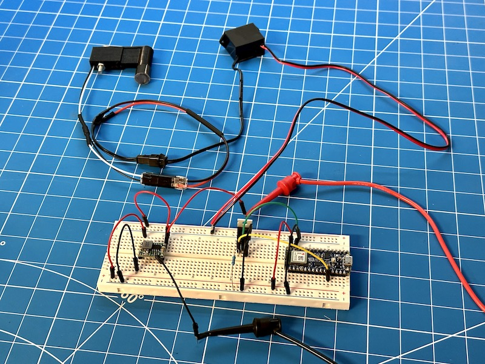

# ASCOM-Compatible Spectral Calibrator

<!-- toc -->

- [Introduction](#introduction)
- [Finished Product](#finished-product)
- [Pre-Requisites](#pre-requisites)
- [Hardware](#hardware)
- [ASCOM Driver](#ascom-driver)
- [Downloading And Installing The Driver](#downloading-and-installing-the-driver)
- [Compiling The Driver (For Developers Only)](#compiling-the-driver-for-developers-only)
- [Screenshots](#screenshots)
- [Arduino Firmware](#arduino-firmware)
- [Microcontroller Compatibility](#microcontroller-compatibility)
- [Compiling And Uploading The Firmware](#compiling-and-uploading-the-firmware)
- [Enclosure](#enclosure)
- [Electronic Circuit](#electronic-circuit)

<!-- tocstop -->

## Introduction

In order for a spectrum to be useful, it must be accurately calibrated. Spectrographic calibration is a vast topic that I will not cover here, but you can learn more about it by reading [the documentation of specINTI & specINTI Editor](http://www.astrosurf.com/solex/specinti1_en.html), which contains a lot of very useful information.

This project covers the design and the implementation of an ASCOM-compatible spectral calibrator. A spectral calibrator usually makes use of a [gas-discharge lamp](https://en.wikipedia.org/wiki/Gas-discharge_lamp) in order to provide a set of well known emission lines that software such as specINTI can then use to calculate the coefficients of the polynomial used to characterize the spectral dispersion of your particular spectrograph, which then allows it to extract a spectral profile from a 2D spectrum. Here is an example image of the 2D spectrum, surrounding the H⍺ line, of a star (β Lyr, also known as Sheliak, a famous Be star) and the superimposed emission lines of a neon bulb that was used for calibration:


It is extremely useful to be able to remotely turn the spectral calibrator _on_ or _off_ multiple times throughout the night. This can be done manually, using a remote-controlled power switch. But it is even more convenient to be able to control the spectral calibrator _programmatically_, for two reasons:

1. If you use the "standard" calibration mode (mode #0 in specINTI - refer to the specINTI documentation for more details), you will want to automatically turn the calibrator _on_ or _off_ as part of your acquisition sequence. The calibrator does not need to be _on_ while you are acquiring the science images (injecting light can make it more difficult to guide on a faint star), but it will need to be _on_ for a short time at the beginning and at the end of the sequence in order to acquire reference spectra which will later be used to calibrate your science images.
2. If you use the "lateral" calibration mode (mode #3 in specINTI), you will want to "blink" the calibrator throughout a science image acquisition in order to modulate the intensity of the calibration lines.

This device accomplishes these two goals in one neat package. It only requires a 12V DC power cable, which is fairly standard in astrophotography. The imaging computer communicates with the device using [Bluetooth Low Energy](https://en.wikipedia.org/wiki/Bluetooth_Low_Energy) (Why use BLE instead of a USB cable? I am trying to move away from using cables, as much as possible, on all of my DIY devices because my telescope cabling is a mess, and we live in the 21st century...) The device is represented as an ASCOM Switch component, so it can easily be turned _on_ or _off_ by pretty much any acquisition software. It also supports a custom action that allows it to set a ["duty cycle"](https://en.wikipedia.org/wiki/Duty_cycle) so that the calibrator can be blinked.

## Demo

The following video shows a working prototype of this project:

[](https://youtu.be/eS6xX8gLDxU)

## Finished Product

TODO

## Pre-Requisites

* A Windows computer (Windows 10 or newer)
* [Microsoft Visual Studio](https://visualstudio.microsoft.com/) (FYI, I used the 2022 edition...)
* [ASCOM Platform](https://ascom-standards.org/)
* [ASCOM Platform Developer Components](https://ascom-standards.org/COMDeveloper/Index.htm)
* [Arduino IDE](https://www.arduino.cc/en/software) — Version 2 is highly recommended!
* [FreeCAD](https://www.freecadweb.org/), a free and open-source 3D parametric modeler
* A 3D printer and a slicer (I use a heavily upgraded Creality Ender 3 v2, and Ultimaker Cura)
* A few basic tools that any tinkerer must own, such as a breadboard, a soldering iron, etc.

## Hardware

The following are just suggestions... Also, over time, some of the links may no longer work...

* [Arduino Nano 33 BLE](https://store.arduino.cc/products/arduino-nano-33-ble)
* [IRF520N MOSFET](https://www.amazon.com/dp/B082J3FNJS)
* 1KΩ resistor (get yourself an assortment of resistors, like [this one](https://www.amazon.com/dp/B08FD1XVL6))
* [MINI360 buck converter](https://www.amazon.com/dp/B07T7L51ZW)
* [Perforated Circuit Board](https://www.amazon.com/dp/B07NM68FXK)
* [DC Power Jack](https://www.amazon.com/dp/B01N8VV78D)
* [Bench Power Supply](https://www.amazon.com/dp/B07GCJ5QHF)
* [Threaded inserts for 3D printed parts](https://www.amazon.com/dp/B07VFZWWXY)
* [Assortment of small metric screws, nuts, and washers](https://www.amazon.com/dp/B08JCKH31Q)
* [22AWG solid core electrical wires](https://www.amazon.com/dp/B088KQFHV7)
* [12V DC EL wire inverter](https://www.amazon.com/dp/B08Q7CNZ7F)
* [Neon bulbs](https://www.amazon.com/dp/B07CPY6TM5) — You may also experiment with the small gas-discharge bulb embedded inside ballast starters used to light up fluorescent lights...

## ASCOM Driver

### Downloading And Installing The Driver

**Step 1:** Download the driver from the [releases page](https://github.com/jlecomte/ascom-spectral-calibrator/releases), and place the file `ASCOM.DarkSkyGeek.SpectralCalibrator.dll` somewhere on your system (example: `C:\Users\julien\ascom-spectral-calibrator\`).

**Step 2:** Open a command prompt, but make sure you run it **as an administrator**!

**Step 3:** Then, proceed with the installation of the driver using `RegAsm.exe`, a utility that should already be present on your system (it comes with the .NET framework). Just don't forget to use the 64 bit version, and to pass the `/tlb /codebase` flags. Here is what it looked like on my imaging mini computer:

```
> cd C:\Users\julien\ascom-oag-focuser\
> C:\Windows\Microsoft.NET\Framework64\v4.0.30319\RegAsm.exe /tlb /codebase ASCOM.DarkSkyGeek.SpectralCalibrator.dll
Microsoft .NET Framework Assembly Registration Utility version 4.8.4161.0
for Microsoft .NET Framework version 4.8.4161.0
Copyright (C) Microsoft Corporation.  All rights reserved.

Types registered successfully
```

**Note:** The output may be more verbose than the above. As long as it says `Types registered successfully`, you are good to go!

**Note:** Once the driver has been installed, make sure you do _not_ delete or move the `ASCOM.DarkSkyGeek.SpectralCalibrator.dll` file, or things will not work! (if you do move it, you will need to register it again in its new location)

**Step 4:** Start (or restart, if it was already running) N.I.N.A. (or whatever application you use to control your equipment).

### Compiling The Driver (For Developers Only)

Open Microsoft Visual Studio as an administrator (right-click on the Microsoft Visual Studio shortcut, and select "Run as administrator"). This is required because when building the code, by default, Microsoft Visual Studio will register the compiled COM components, and this operation requires special privileges (Note: This is something you can disable in the project settings...) Then, open the solution (`ASCOM_Driver\ASCOM.DarkSkyGeek.SpectralCalibrator.sln`), change the solution configuration to `Release` (in the toolbar), open the `Build` menu, and click on `Build Solution`. As long as you have properly installed all the required dependencies, the build should succeed and the ASCOM driver will be registered on your system. The binary file generated will be `ASCOM_Driver\bin\Release\ASCOM.DarkSkyGeek.SpectralCalibrator.dll`. You may also download this file from the [Releases page](https://github.com/jlecomte/ascom-spectral-calibrator/releases).

### Screenshots

The ASCOM driver provides a settings dialog which allows you to select the BLE device, once it has been detected. This is an operation you only really need to do once, because your selection is stored in your ASCOM profile. This must be done upon first connection, for obvious reasons.


## Arduino Firmware

### Microcontroller Compatibility

The firmware was written specifically for, and tested with a genuine Arduino Nano 33 BLE, and I strongly recommend you use that. However, it should technically work on all Arduino-compatible boards that support BLE, including the Seeeduino Xiao nRF52840. If you are planning to use the Xiao nRF52840, please refer to the comments at the top of the file `Arduino_Firmware\Arduino_Firmware.ino`. **Note:** I will not provide support for any board other than a genuine Arduino Nano 33 BLE.

### Compiling And Uploading The Firmware

* Open the Arduino IDE, and using the Boards Manager, install the `Arduino Mbed OS Nano Boards by Arduino`, which provides support for the Arduino Nano 33 BLE.
* Finally, connect your Seeeduino board to your computer (make sure you use a USB-C cable that supports data and not just power!), open the sketch file located at `Arduino_Firmware\Arduino_Firmware.ino`, and click on the `Upload` button in the toolbar.

## Enclosure

TODO

## Electronic Circuit

The electronics circuit is fairly straightforward. I included a Fritzing file in the `Electronics/` folder. Here are the schematics:


Here is what the prototype circuit looks like:


Here is the full prototype, showing the EL inverter and the bulb, neatly nested inside a 3D printed enclosure:



And here is what my development setup looks like, showing my computer and a bench power supply:


