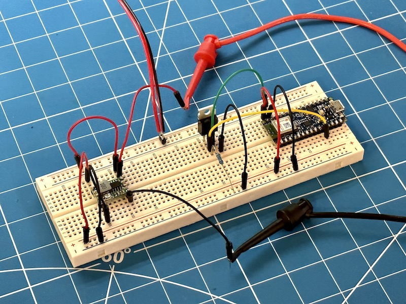
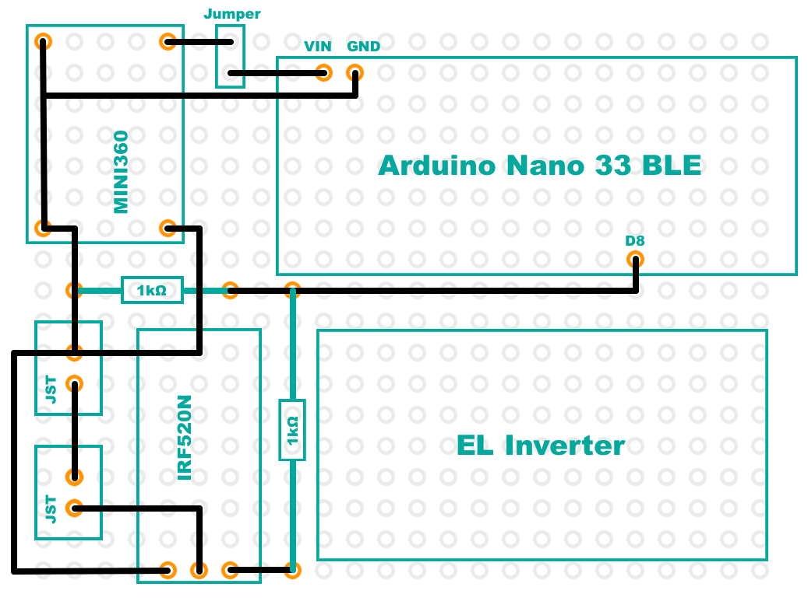

# ASCOM-Compatible Spectral Calibrator

I do not charge anything to create and maintain these open-source projects. But if you would like to say "thanks" for this project, feel free to send any amount through Paypal using the button below. I really appreciate your support!

[](https://www.paypal.com/donate/?hosted_button_id=49UXY8F6VVYFA)

* [Introduction](#introduction)
* [Demo](#demo)
* [Finished Product](#finished-product)
* [Pre-Requisites](#pre-requisites)
* [Hardware](#hardware)
* [ASCOM Driver](#ascom-driver)
  + [Downloading And Installing The Driver](#downloading-and-installing-the-driver)
  + [Compiling The Driver (For Developers Only)](#compiling-the-driver-for-developers-only)
  + [Screenshots And User Manual](#screenshots-and-user-manual)
* [Command Line ASCOM Client (Python)](#command-line-ascom-client-python)
* [Arduino Firmware](#arduino-firmware)
  + [Microcontroller Compatibility](#microcontroller-compatibility)
  + [Compiling And Uploading The Firmware](#compiling-and-uploading-the-firmware)
* [Enclosure](#enclosure)
* [Electronic Circuit](#electronic-circuit)
* [Frequently Asked Questions (FAQ)](#frequently-asked-questions-faq)

## Introduction

In order for a spectrum to be useful, it must be accurately calibrated. Spectrographic calibration is a vast topic that I will not cover here, but you can learn more about it by reading [the documentation of specINTI & specINTI Editor](http://www.astrosurf.com/solex/specinti1_en.html), which contains a lot of very useful information.

This project covers the design and the implementation of an ASCOM-compatible spectral calibrator. A spectral calibrator usually makes use of a [gas-discharge lamp](https://en.wikipedia.org/wiki/Gas-discharge_lamp) in order to provide a set of well known emission lines that software such as specINTI can then use to calculate the coefficients of the polynomial used to characterize the spectral dispersion of your particular spectrograph, which then allows it to extract a spectral profile from a 2D spectrum. Here is an example image of the 2D spectrum, surrounding the H⍺ line, of a star (β Lyr, also known as Sheliak, a famous Be star) and the superimposed emission lines of a neon bulb that was used for calibration:


It is extremely useful to be able to remotely turn the spectral calibrator _on_ or _off_ multiple times throughout the night. This can be done manually, using a remote-controlled power switch. But it is even more convenient to be able to control the spectral calibrator _programmatically_, for two reasons:

1. If you use the "standard" calibration mode (mode #0 in specINTI - refer to the specINTI documentation for more details), you will want to automatically turn the calibrator _on_ or _off_ as part of your acquisition sequence. The calibrator does not need to be _on_ while you are acquiring the science images (injecting light can make it more difficult to guide on a faint star), but it will need to be _on_ for a short time at the beginning and at the end of the sequence in order to acquire reference spectra which will later be used to calibrate your science images.
2. If you use the "lateral" calibration mode (mode #3 in specINTI), you will want to "blink" the calibrator throughout an acquisition in order to modulate the intensity of the calibration lines. Indeed, if those calibration lines saturate the imaging sensor, you will not be able to cleanly subtract them from the target spectrum. You will also degrade the accuracy of the calibration, which defeats the point of using this calibration mode...

This device accomplishes these two goals in one neat package. It only requires a 12V DC power cable, which is fairly standard in astrophotography. The imaging computer communicates with the device using [Bluetooth Low Energy](https://en.wikipedia.org/wiki/Bluetooth_Low_Energy) (Why use BLE instead of a USB cable? I am trying to move away from using cables, as much as possible, on all of my DIY devices because my telescope cabling is a mess, and we live in the 21st century...) The device is represented as an ASCOM Switch component, so it can easily be turned _on_ or _off_ by pretty much any acquisition software. It also supports a custom action that allows it to set a ["duty cycle"](https://en.wikipedia.org/wiki/Duty_cycle) so that the calibrator can be blinked.

## Demo

The following video shows a working prototype of this project:

[](https://youtu.be/GdbAIkDWJys)

## Finished Product


## Pre-Requisites

* A Windows computer (Windows 10 or newer)
* [Microsoft Visual Studio](https://visualstudio.microsoft.com/) (FYI, I used the 2022 edition...)
* [ASCOM Platform](https://ascom-standards.org/)
* [ASCOM Platform Developer Components](https://ascom-standards.org/COMDeveloper/Index.htm)
* [Arduino IDE](https://www.arduino.cc/en/software) — Version 2 is highly recommended!
* [FreeCAD](https://www.freecadweb.org/), a free and open-source 3D parametric modeler
* A 3D printer and a slicer (I use a heavily upgraded Creality Ender 3 v2, and Ultimaker Cura)
* A few basic tools that any tinkerer must own, such as a breadboard, a soldering iron, etc.

## Hardware

**Note:** The following are just suggestions! Some of these links will not work if you access them from outside the USA. However, using the name and the photograph below, you should (hopefully) be able to find similar items elsewhere. Also, over time, some of the links may no longer work...

* [Arduino Nano 33 BLE](https://store.arduino.cc/products/arduino-nano-33-ble)
* [IRF520N MOSFET](https://www.amazon.com/dp/B082J3FNJS)
* A few resistors (get yourself an assortment of resistors, like [this one](https://www.amazon.com/dp/B08FD1XVL6))
* [MINI360 buck converter](https://www.amazon.com/dp/B07T7L51ZW)
* [Perforated Circuit Board](https://www.amazon.com/dp/B07NM68FXK)
* [DC Power Jack](https://www.amazon.com/dp/B01N8VV78D)
* [Bench Power Supply](https://www.amazon.com/dp/B07GCJ5QHF)
* [Threaded inserts for 3D printed parts](https://www.amazon.com/dp/B07VFZWWXY)
* [Assortment of small metric screws, nuts, and washers](https://www.amazon.com/dp/B08JCKH31Q)
* [22AWG solid core electrical wires](https://www.amazon.com/dp/B088KQFHV7)
* [12V DC EL wire inverter](https://www.amazon.com/dp/B08Q7CNZ7F)
* [Neon bulbs](https://www.amazon.com/dp/B07CPY6TM5). You may also experiment with the small gas-discharge bulb embedded inside ballast starters used to light up fluorescent lights. Either way, you will need to solder a resistor, between 20kΩ and 50kΩ, to the bulb since the output voltage is a little over 100V.


## ASCOM Driver

### Downloading And Installing The Driver

Starting with version `1.2.1`, you can install the ASCOM driver by simply running the executable setup file that you will find in the [releases page](https://github.com/jlecomte/ascom-spectral-calibrator/releases). By default, it places files under `C:\Program Files (x86)\Dark Sky Geek\Spectral Calibrator ASCOM Driver`.

### Compiling The Driver (For Developers Only)

Open Microsoft Visual Studio as an administrator (right-click on the Microsoft Visual Studio shortcut, and select "Run as administrator"). This is required because when building the code, by default, Microsoft Visual Studio will register the compiled COM components, and this operation requires special privileges (Note: This is something you can disable in the project settings...) Then, open the solution (`ASCOM_Driver\ASCOM.DarkSkyGeek.SpectralCalibrator.sln`), change the solution configuration to `Release` (in the toolbar), open the `Build` menu, and click on `Build Solution`. As long as you have properly installed all the required dependencies, the build should succeed and the ASCOM driver will be registered on your system. The binary file generated will be `ASCOM_Driver\bin\Release\ASCOM.DarkSkyGeek.SpectralCalibrator.dll`. You may also download this file from the [Releases page](https://github.com/jlecomte/ascom-spectral-calibrator/releases).

### Screenshots And User Manual

Before you can connect to the spectral calibrator for the first time, you must select the appropriate Bluetooth device in the driver settings dialog. The driver will remember your selection, so this is a one-time operation. This step is necessary to ensure that, in the field, where there may be several such spectral calibrators nearby, you are connecting and controlling the right device. Here is what the driver settings dialog looks like the first time you open it. It listens for Bluetooth advertisement packets coming from spectral calibrator devices only.


Of course, the Bluetooth address will be meaningless to you, but that is not important. Click on a Bluetooth address, and click on the "Pair with selected device" button:


**Note:** This is not really Bluetooth pairing. It is merely device selection. But most users are familiar with the "Bluetooth pairing" terminology, so I used it, even if it is not perfectly accurate from a technical standpoint...

Don't forget to validate your choice by clicking on the green checkmark button at the bottom of the device settings dialog! (otherwise, your selection will not be taken into account)

If you do this at home with only one spectral calibrator turned on, you should see only one Bluetooth address in the list, so that's easy. However, if you do this in the field, and there is another spectral calibrator nearby, you may see several Bluetooth addresses. Choose one, connect to it, and turn it on/off to identify which device you are connected to. If you happened to select the wrong device, disconnect it, open the driver settings dialog again, and choose another Bluetooth address (you will have remembered the Bluetooth address you connected to on the first try...) Simple! Of course, it's easier to do this at home when there is only one device showing in the list... Once the right device has been selected, you can finally connect to it, which will reveal an ASCOM switch device, here shown in N.I.N.A.'s UI:


## Command Line ASCOM Client (Python)

A simply Python script is included in the `ASCOM_Client/` directory. In ordet to use it, you will first need to [download and install Python 3 for your platform](https://www.python.org/downloads/). Then, you will need to install the `pypiwin32` package:

```
C:> python -m pip install pypiwin32
```

Next, make sure that your ASCOM profile already has a spectral calibrator "paired" with your PC. Refer to the [Screenshots And User Manual](#screenshots-and-user-manual) section above to find out how to do this.

Finally, you can run this script. Here are a few examples:

```
C:> calibrator.py --help
C:> calibrator.py on
C:> calibrator.py off
C:> calibrator.py dutycycle --help
C:> calibrator.py dutycycle 25
```

**Note:** The argument passed to the `dutycycle` command is a whole percentage, and must therefore be an integer between `0` and `100`, where `0` means "always off", and `100` means "always on". Any value in between will cause the device to blink with a period of 1 minute. So, a value of `25` means that the device will be _off_ for 45 seconds, and _on_ for 15 seconds.

**Note:** You can stop the _on_/_off_ cycle by simply turning the calibrator _off_.

## Arduino Firmware

### Microcontroller Compatibility

The firmware was written specifically for, and tested with a genuine Arduino Nano 33 BLE, and I strongly recommend you use that. However, it should technically work on all Arduino-compatible boards that support BLE, including the Seeeduino Xiao nRF52840. If you are planning to use the Xiao nRF52840, please refer to the comments at the top of the file `Arduino_Firmware\Arduino_Firmware.ino`. **Note:** I will not provide support for any board other than a genuine Arduino Nano 33 BLE.

### Compiling And Uploading The Firmware

* Open the Arduino IDE, and using the Boards Manager, install the `Arduino Mbed OS Nano Boards by Arduino`, which provides support for the Arduino Nano 33 BLE.
* Finally, connect your Seeeduino board to your computer (make sure you use a USB-C cable that supports data and not just power!), open the sketch file located at `Arduino_Firmware\Arduino_Firmware.ino`, and click on the `Upload` button in the toolbar.

**Note:** Make sure that the Arduino board is not connected to the MINI360 when you connect the Arduino to your computer because these little buck converters do not like to have a voltage applied to their output. They get very hot, and it smells like something is burning... That is why there is a jumper on the PCB, so that you can temporarily disconnect the Arduino from the buck converter.

## Enclosure

Here is a 3D rendering of the enclosure:


The FreeCAD model is `3D_Files/Enclosure.FCStd`, in case you want to tweak it. I also generated the STL files, which you will find in the `3D_Files/STL/` directory. Those can be imported into your slicer.

Also note that I included the FreeCAD model for the micro bulb holder at `3D_Files/Micro_Bulb_Holder.FCStd`. Here is what that model looks like:


## Electronic Circuit

The electronics circuit is fairly straightforward. I included a Fritzing file in the `Electronics/` folder. Here are the schematics:


Here is what the prototype circuit looks like:



Here is the full prototype, showing the EL inverter and the bulb neatly nested inside a 3D printed enclosure:


**Note:** There is no gate resistor on the two photographs above, but it is generally _good practice_ to have one for a variety of reasons. In our case, since we are switching the MOSFET at low frequency, the only real reason we might want to use a gate resistor is to limit the peak current drawn from the GPIO pin when turning on the MOSFET (remember: the gate on a MOSFET acts as a strong capacitor) to a level the MCU can handle without frying. In practice, it seems to work fine without one, but just to be safe, I included a 1KΩ gate resistor in the schematics above, and it is in the photographs below as well. A 1KΩ pulldown resistor is absolutely essential, however, because the MOSFET gate needs a way to discharge upon turning it off...

Turning this into a usable product requires the following PCB routing diagram:



And finally, here is what the prototype circuit on a perforated circuit board looks like:


And here is the PCB attached to the enclosure, using 4 M2 screws:


## Frequently Asked Questions (FAQ)

**Question:** Can you make this for me? I'll pay for it!

**Answer:** Nope. Not interested.

**Question:** My antivirus identifies your setup executable file as a malware (some kind of Trojan)

**Answer:** This is a false detection, extremely common with installers created with [Inno Setup](https://jrsoftware.org/isinfo.php) because virus and malware authors also use Inno Setup to distribute their malicious payload... Anyway, there isn't much I can do about this, short of signing the executable. Unfortunately, that would require a code signing certificate, which costs money. So, even though the executable I uploaded to GitHub is perfectly safe, use at your own risk!
